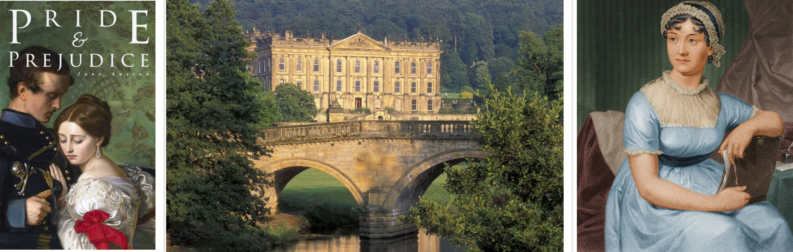

# PemberleyGPT

PemberleyGPT is a character-level language model trained on the works of Jane Austen, designed to generate prose in the style of her iconic novels. Using a Transformer-based architecture, the model captures the elegant and sophisticated language that Austen is known for.


## Model Overview

The model is implemented using PyTorch and follows the architecture of a simple transformer with multiple self-attention heads and feedforward layers. It has been trained on text extracted from Austen's works to generate character-level outputs, which aim to mimic the distinct writing style of the author.

### Key Features

- **Character-level Model:** The model works at the character level, allowing for detailed reproduction of Jane Austen's writing style.
- **Transformer Architecture:** It utilizes multiple transformer blocks, each comprising a multi-head self-attention mechanism and feedforward layers.
- **Context Length:** The model can handle a maximum context length of 32 tokens, which helps in generating coherent text sequences.

### Hyperparameters

- **Batch Size:** 16
- **Block Size (Context Length):** 32
- **Embedding Dimension (n_embd):** 64
- **Number of Heads:** 4
- **Number of Transformer Layers:** 4
- **Learning Rate:** 1e-3
- **Dropout:** 0.0

## Training

The model was trained on a dataset derived from Jane Austen's works (`austen.txt`), which can be obtained using the following command:

```sh
wget https://raw.githubusercontent.com/muskan09/PemberleyGPT/refs/heads/main/austen.txt
```
The text was split into training and validation sets, with 90% of the data used for training and 10% for validation. The model was trained for 5000 iterations, with periodic evaluation on both training and validation sets.

## Usage
The following script demonstrates how to train and generate text from the model:

1. Train the model:
The code is available as a Jupyter notebook (PemberleyGPT.ipynb) that can be easily run on Google Colab with GPU acceleration for faster training. The training script provided above can be either uploaded on Google Colab or copied and pasted into a Google Colab cell to train the model interactively.

2. Generate text:
The model generates text starting from a given prompt. For instance, to generate 2000 tokens of text:
```sh
context = torch.zeros((1, 1), dtype=torch.long, device=device)
print(decode(model.generate(context, max_new_tokens=2000)[0].tolist()))
```

## Results
The model can generate long passages of prose that reflect Jane Austen's language style. However, since it's a character-level model, the coherence and grammatical correctness of the generated text can sometimes be limited.
Here's what PemberleyGPT generated:
```sh
"Disas not make of the was man Mrs. Noney, “I a with--Yand he good---in the regines's profesed found you was quite wouth his they binagee indectionite, she was to so nothavous was pleass of suence, and the pat her terney." 
For up resend intereday they I shall them trilide. In You dare than wish shorpy's me. 
"I added before Mrs. Wesves sept estrancy thous piness self perpatills concise." "The thought it of Kitty this no saying as youung if so, seled I whoman, that he had been thought I reallia's certained, and such any were surpo, and to take--Swered, of which was it belieful!: She shume was so by, ralline_ they way very oself thought been Mranny." But his very quarticy of which well, appy, who redich regater the was if in they repleta!” “I hopowed' answerat as on few unc. I all am: than she herpall?--and my diner to usuan eeginess parpiness was so now sister," 
“He is do noceity are  singlecred to a folling absort have sinies, for then dissure; aftend than their most very mucked; that Miss Weston Tpless this nothing;" his were he was Captain after thought, and sistiles's privations.” 
“What person too tat beyou," said Morning---she dearting but farter carefort be in talme, seeing Batter, "” “I could and he had sateation; "Oh! . Than I was naturalges, but that 4fAs I cany quittless only "Bive I have intendent in the him.  You Resconds her generen of Surprains, the did beliefure, manny wintous as take Wich if 
"No Bestorton, my soartous with by so heraring. "But as sset I comaning, for thit.” No did Gerana, acconious at his wi presmiting in was to tak ; but he had could beturn that his does nocluch, turned you who peled those we right, was not that pies and looked any intations, will it his forment. "I so could givented three dear in quite dear Fanny looked nors, takent any so pubt_ that findsuch a frond you believed. Mrs. Mrs. Elton Sund his talking look?” 
“Wen, and which thatles, friend you mund” clupose moure for the had as a very duch littless by Haretterd take
```

## Acknowledgments
This project is inspired by my favorite author, Jane Austen, and aims to pay tribute to her work by generating new, original passages reminiscent of her writing. Special thanks to Andrej Karpathy for his inspiring tutorials on language models, which greatly influenced the development of PemberleyGPT.

## License
This project is licensed under the MIT License.See the LICENSE file for more information.
